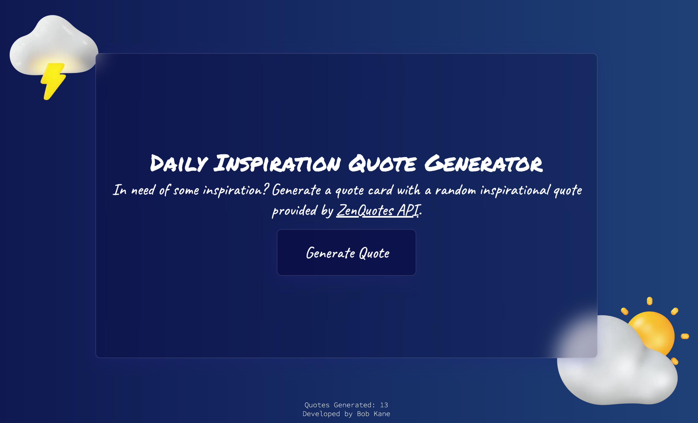

# ✨ Inspirational Quote Generator ✨

A full stack serverless web app that generates inspirational quotes with the click of a button. 

Users can then preview the quote by hovering over the generated quote card and download each quote card as a PNG image by clicking the "Download your quote card" button. 

The counter at the bottom of the screen keeps track of the number of quotes generated and updates in real time.

The app is fully responsive and works on all screen sizes. 

It deploys both the frontend and backend using AWS Amplify. The frontend is built using Next.js and TypeScript, and is styled using Styled Components and Material UI. The backend is built using Node.js, AWS Lambda functions, AWS AppSync, and GraphQL. The ZenQuotes API is used for fetching random quotes and the database is built using AWS DynamoDB.

**Technologies used:** Typescript, Next.js, Node.js, AWS (Amplify, DynamoDB, Lambda, AppSync), GraphQL, Styled Components, Material UI, and ZenQuotes API.

**Additional packages:** Sharp for image processing, Node-fetch for fetch data with Node.js outside the server, and React-lottie-player for creating the animated download icon.

Click **[here](https://prod.d2a0otcniyvk3z.amplifyapp.com)** to view the live site demo.

## 📷 Screenshots

**Homepage:**

 

**Quote generated:**

 

**Quote card preview on hover:**

